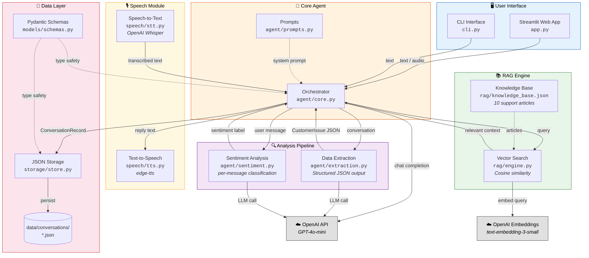
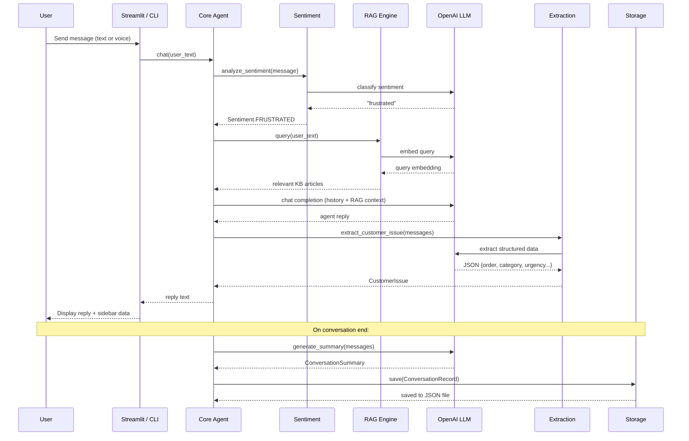

# TechMart Customer Support Agent

An intelligent conversational AI agent for **TechMart**, a fictional online electronics store. The agent conducts natural customer support conversations, extracts structured data in real time, and provides knowledge-base-backed resolutions.


---

## Features

### Core
- **Natural conversation** — LLM-driven multi-turn customer support dialogue
- **Real-time data extraction** — Extracts order number, problem category, description, urgency, and more into structured JSON after each turn
- **Data validation** — Pydantic models enforce field types; agent validates order number format conversationally
- **Conversation storage** — Each conversation is persisted as a JSON file with full message history and extracted data
- **Conversation summary** — Auto-generated summary with key points and resolution at conversation end
- **Error handling** — Graceful fallbacks for API failures, invalid input, and edge cases

### Bonus
- **RAG (Retrieval-Augmented Generation)** — 10-article knowledge base embedded with OpenAI embeddings; cosine similarity search injects relevant context into each response
- **Sentiment analysis** — Per-message sentiment classification (positive / neutral / negative / frustrated) to detect customer frustration
- **Multi-turn memory** — Full conversation context preserved via OpenAI chat history
- **Multi-language support** — Agent responds in the customer's language (tested with English and Spanish)
- **Text-to-Speech** — Agent replies read aloud via edge-tts (free, no API key)
- **Speech-to-Text** — Voice input transcribed via OpenAI Whisper

---

## System Architecture



### Request Flow



### Component Responsibilities

| Component | Purpose |
|---|---|
| `agent/core.py` | Main orchestrator — manages conversation state, calls LLM, triggers extraction/sentiment/RAG |
| `agent/extraction.py` | Extracts structured `CustomerIssue` from conversation using LLM |
| `agent/sentiment.py` | Classifies each user message sentiment |
| `agent/prompts.py` | All system prompts and templates (single source of truth) |
| `rag/engine.py` | Embeds knowledge base, performs cosine-similarity retrieval |
| `speech/tts.py` | Text-to-speech via edge-tts |
| `speech/stt.py` | Speech-to-text via OpenAI Whisper |
| `storage/store.py` | JSON file persistence for conversation records |
| `models/schemas.py` | Pydantic data models for type safety and serialization |

---

## Setup Instructions

### Prerequisites
- Python 3.10+
- An OpenAI API key ([get one here](https://platform.openai.com/api-keys))

### Installation

```bash
# Clone the repository
git clone https://github.com/your-username/orbio-support-agent.git
cd orbio-support-agent

# Create virtual environment
python -m venv venv
source venv/bin/activate        # Linux/Mac
# or
venv\Scripts\activate           # Windows

# Install dependencies
pip install -r requirements.txt

# Configure environment
cp .env.example .env
# Edit .env and add your OPENAI_API_KEY
```

### Running

**Web App (Streamlit):**
```bash
streamlit run app.py
```

**CLI:**
```bash
python cli.py
```

---

## Key Design Decisions

1. **LLM-driven conversation flow** — Rather than a rigid state machine, the LLM drives the conversation naturally based on a detailed system prompt. This allows for more humanlike interactions while still collecting required information.

2. **Per-turn extraction** — Structured data is extracted after every user message, giving real-time visibility into what's been collected. The extraction uses a separate zero-temperature LLM call for accuracy.

3. **RAG with cosine similarity** — The knowledge base is embedded once at startup using OpenAI embeddings. At query time, a simple cosine similarity search retrieves relevant articles. This avoids heavy dependencies like vector databases while still being effective for a small-to-medium knowledge base.

4. **Pydantic for data integrity** — All data flows through Pydantic models, ensuring type safety, validation, and easy JSON serialization/deserialization.

5. **edge-tts for TTS** — Chose edge-tts (free Microsoft Edge TTS) over paid APIs to minimize cost while providing high-quality speech synthesis.

6. **Modular architecture** — Each concern (conversation, extraction, sentiment, RAG, speech, storage) is in its own module, making it easy to swap implementations or add new features.

---

## Potential Improvements

- **Streaming responses** — Stream LLM output token-by-token for better UX
- **Vector database** — Replace in-memory embeddings with Pinecone/Weaviate/ChromaDB for larger knowledge bases
- **Authentication** — Add user authentication to track returning customers
- **Database storage** — Move from JSON files to PostgreSQL/MongoDB for production scale
- **Caching** — Cache embeddings and frequent queries to reduce API costs
- **Agent tools** — Give the LLM access to tools (order lookup, refund initiation) via function calling
- **Evaluation framework** — Automated conversation quality scoring and regression testing
- **Webhooks** — Integrate with ticketing systems (Zendesk, Freshdesk) to create tickets from conversations
- **Rate limiting** — Add request rate limiting for production deployment
- **Observability** — Add structured logging, tracing, and metrics

---

## Running Tests

```bash
pytest tests/ -v
```

Tests use mocked LLM calls to avoid API dependency and cost.

---

## Sample Conversations

See [`samples/sample_conversations.md`](samples/sample_conversations.md) for full example dialogues demonstrating:
- Shipping delay resolution
- Defective product with frustrated customer
- Payment double-charge investigation
- Multi-language support

---

## License

MIT
